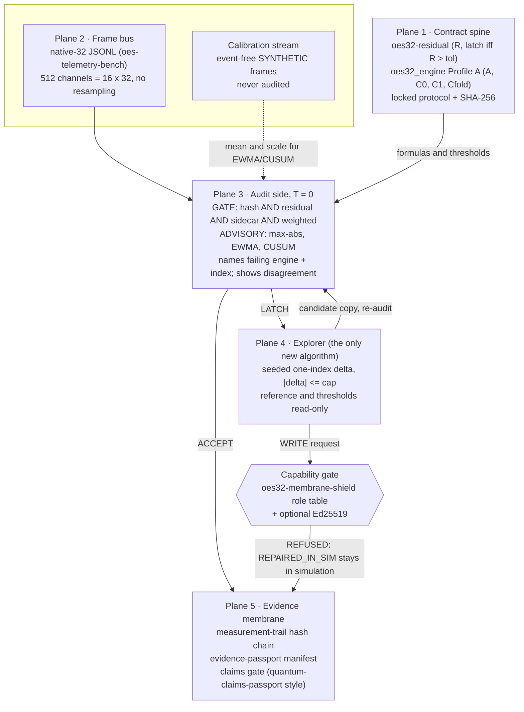

# spark-membrane

[](https://github.com/sparkainlp-x/spark-membrane/actions/workflows/ci.yml)
[](LICENSE)
[](pyproject.toml)
[](https://sparkainlp-x.github.io/spark-membrane/)
[](#evidence-and-limitations)
[](docs/PROTOCOL.md)
[](#how-to-cite)

> **SYNTHETIC: classical software simulation on generated numbers.**
> Not a medical device, not control software, not sensor fusion, not field evidence.

**Abstract.** spark-membrane is an offline, standard-library Python console that audits synthetic 32-channel frames against the existing Spark AI NLP OES repositories. Each repository is pinned by commit SHA; none is copied or merged. Every frame passes through separate deterministic checks:

- the protocol hash;
- the normative oes32-residual latch;
- the oes32_engine Profile A sidecar;
- the oes-resilience weighted score.

A frame is accepted only if all of them pass (check-conjunction, not a vote). The two OES-32 formulas are never blended into one score. On a latch, the console names each failing engine and channel index, and it shows where the gating engines and the advisory baselines (max-abs, EWMA, CUSUM) disagree. A seeded explorer, the only new algorithm here, then tries one capped single-index edit on a copy of the frame and re-audits it, in simulation only. Every step is hash-chained into a trail and summarised in an evidence passport. A claims gate refuses overclaims. Every threshold is an uncalibrated placeholder, and the repository leads with the negative results of the projects it builds on.

**Live page:** <https://sparkainlp-x.github.io/spark-membrane/> · **Author:** Jean-François Brisson ([ORCID 0009-0000-9778-5374](https://orcid.org/0009-0000-9778-5374)), Spark AI NLP

## Evidence and limitations

### Read this first: results that do not flatter OES32

These come from the pinned repositories. The console prints them before anything else, and so does the page.

| Result | Source (pinned) | Class |
|---|---|---|
| On the locked NASA SMAP/MSL protocol, OES32 **did not meet its pre-stated success criterion**: it beat only EWMA on SMAP, and maxabs and CUSUM scored a higher pooled F1 (not significantly). | [oes-resilience](https://github.com/sparkainlp-x/oes-resilience/tree/1ee533cd4360a6b1415f923c4e52cfc166b8917a) v0.5.0 | public dataset, negative |
| On the oes-telemetry-bench held-out synthetic set, **max-abs matched OES32's detections (6/7 each) with fewer false alarms (11.54 vs 23.08 false-alarm episodes per normal hour)**. The rates come from about 5 minutes of synthetic normal time and are highly uncertain. | [oes-telemetry-bench](https://github.com/sparkainlp-x/oes-telemetry-bench/tree/48fc4d9b79e58557cc562b8dad0bc90b482d443f) | SYNTHETIC, negative |
| The multi-quantum-oes preregistered stress evaluation found **no demonstrated advantage**: the block score did not beat a simple max-abs baseline (fixed 0.50: 5/11 vs 8/11 events; calibrated: 0/11 each). | [multi-quantum-oes](https://github.com/sparkainlp-x/multi-quantum-oes/tree/132e0a7b2ae05c742d5b0d91be221cc0d2def106) | SYNTHETIC, negative |
| oes32-hls FPGA synthesis is **UNRUN**; its latency figure is a design target. | [oes32-hls](https://github.com/sparkainlp-x/oes32-hls/tree/56a4cc29f0bfed84583fe9c21879daefdb2a116c) | UNRUN |
| The qldpc_decoder_cpp HLS kernel has no belief-propagation updates yet; synthesis and hardware runs are **UNRUN**. | [qldpc_decoder_cpp](https://github.com/sparkainlp-x/qldpc_decoder_cpp/tree/908c65dd6eb30f21ffab3348704001e4155151cd) | UNRUN |

There is no NASA-beat claim here. The dual-engine split (an exploratory proposer outside a zero-entropy auditor) is an **external inspiration**; the pinned repositories do not already implement it.

### Limitations of this console

- **Every threshold and cap is a placeholder.** Each is either an upstream default or an author choice; none was fitted to data. [`docs/PROTOCOL.md`](docs/PROTOCOL.md) lists every parameter with its source, and the tests fail if a parameter is undocumented.
- **The gate misses slow drift in its own demo.** On seed 42, frames t=30–33 carry a slow common drift of 0.025. The gate ACCEPTs them and only the advisory EWMA/CUSUM fire. The console reports this rather than hiding it.
- **Engine disagreement.** It counts frames where the six engine families do not all agree. It is information, not a vote. For seed 42 it is **7 frames**: all event frames, none on clean frames. The v1 demo reported 19, because EWMA/CUSUM were standardized on a very quiet in-stream warm-up and never restarted, so one large event kept them alarmed for the rest of the stream. v2 standardizes them on a separate event-free calibration stream and restarts them after an alarm. The restart is an author choice; upstream oes-resilience defines no reset.
- **Re-implementations, not the upstream packages.** The engines are small labelled re-implementations, checked against outputs of the pinned upstream code (see [How the re-implementations are checked](#how-the-re-implementations-are-checked)).
- **The capability gate admits nothing on role policy alone.** With the optional `[shield]` extra it verifies upstream-format Ed25519 capabilities. Without it, every signed capability is refused. It is a compatible re-implementation for the console, not the upstream library.
- **Evidence limits.** A matching SHA-256 shows byte consistency only. `locked_at` is self-declared. The trail detects edits but not trailing truncation or a full rewrite.

### What it is NOT

A classical software simulation on generated numbers. It is not a medical device, not control software, not sensor fusion and not field evidence, and it makes no quantum, QEC, consciousness, medical or gravity claims. Items in multi-quantum-oes are exact classical toy simulations and never enter the audit. [signal-loom](https://sparkainlp-x.github.io/signal-loom/) is linked as an art skin only.

## Architecture: five planes



| Plane | What runs | Pinned upstream | New code? |
|---|---|---|---|
| 1 · Contract spine | Normative residual `R = max_i \|y_i − x_i\|`, latch iff `R > τ`; Profile A sidecar `SAFE = A ∧ C0 ∧ C1 ∧ Cfold`, `LATCH = ¬SAFE`; capability gate | oes32-residual @ `b77b612` (ADR-001 normative), oes32_engine @ `d66025f`, oes32-membrane-shield @ `f1ca680` | No: labelled re-implementations in [`spark_membrane/engines/`](spark_membrane/engines/) and [`shield.py`](spark_membrane/shield.py), tested against the pins |
| 2 · Frame bus | Native 32-channel JSONL frame contract; 512 channels = 16 native-32 blocks; no interpolation, resampling, padding or imputation | oes-telemetry-bench @ `48fc4d9` | No: re-implemented parser ([`frames.py`](spark_membrane/frames.py)) |
| 3 · Audit side (T=0) | Gate: protocol hash ∧ residual ∧ sidecar (A, C0, C1, Cfold) ∧ weighted score `0.45·max\|x\| + 0.35·RMS + 0.20·mean\|x\| < 0.50`. Advisory: max-abs, EWMA, CUSUM | oes-resilience @ `1ee533c`, oes-telemetry-bench @ `48fc4d9` | Conjunction logic only ([`audit.py`](spark_membrane/audit.py)) |
| 4 · Explorer | Seeded one-index delta, `\|δ\| ≤ 0.25` from the locked protocol, re-audited; `REPAIRED_IN_SIM` or `LATCH_HELD`, evidence class SYNTHETIC | none | **Yes** ([`explorer.py`](spark_membrane/explorer.py)) |
| 5 · Evidence membrane | Hash-chained trail; evidence passport; claims gate | measurement-trail @ `7ab6ec8`, evidence-passport @ `e275bb0`, quantum-claims-passport @ `880ddc9` | Glue only |

## Quickstart

Python 3.10 or newer. There are no runtime dependencies.

```bash
# from a clone (the first command, unchanged)
git clone https://github.com/sparkainlp-x/spark-membrane.git
cd spark-membrane
python3 -m spark_membrane demo --seed 42

# or install it; this adds the `spark-membrane` console script
python3 -m pip install .
spark-membrane demo --seed 42

# optional: Ed25519 verification in the capability gate
python3 -m pip install ".[shield]"
spark-membrane shield-selftest --require-backend

# tests (stdlib unittest; the live upstream tests skip unless SPARK_MEMBRANE_UPSTREAM is set)
python3 -m unittest discover -s tests -v
```

| Command | What it does |
|---|---|
| `demo [--seed N] [--json]` | Seeded SYNTHETIC walk through every plane. |
| `audit --frames F.jsonl [--calibration C.jsonl]` | Audits your own native-32 stream. Exits 3 if any frame latched and 2 on invalid input. Without `--calibration`, EWMA/CUSUM fall back to the upstream 16-frame in-stream warm-up. |
| `shield-selftest [--require-backend]` | Exercises the capability gate. Exits 4 with `--require-backend` if `cryptography` is missing. |
| `verify-trail F.jsonl` | Verifies a hash-chained trail. |
| `pins` / `claims` | Print the pinned commits and the claim ledger. |
| `build-docs [--check]` | Regenerates `docs/` and the root data mirrors. Needs a clone. |

## Example output

Excerpt of `python3 -m spark_membrane demo --seed 42` (full output: [`docs/demo-seed42.txt`](docs/demo-seed42.txt); every check, index and proposal: [`docs/passport/demo-seed42.json`](docs/passport/demo-seed42.json)):

```text
==============================================================================
  SYNTHETIC - classical software simulation on generated numbers.
  Not a medical device, not control software, not sensor fusion, not field evidence.
==============================================================================
PLACEHOLDERS: every threshold and cap is UNCALIBRATED (upstream defaults or author choices; docs/PROTOCOL.md).
READ FIRST - results from the pinned repos that do not flatter OES32: ...
 20     single_channel_spike      LATCH    residual@13 0.1996>0.08; sidecar_A@13 0.1996>0.08; sidecar_C1@13<->29 0.1986>0.08; sidecar_Cfold@13<->14 0.1931>0.08
        engines: DISAGREE fired=residual,sidecar,ewma,cusum quiet=weighted,maxabs
        residual R=0.1996 vs tol 0.08 at index 13 -> LATCH | weighted score=0.1045 vs 0.5 -> quiet  (separate formulas, never blended)
 27     two_channel_fault         LATCH    residual@27 0.1515>0.08; ... sidecar_C0@2<->18 0.1557>0.08; ...
        engines: DISAGREE fired=residual,sidecar quiet=weighted,maxabs,ewma,cusum
 30-33  slow_common_drift         ACCEPT   - | DISAGREE fired=ewma,cusum quiet=residual,sidecar,weighted,maxabs
  Gate ACCEPTED while advisory engines (cusum, ewma) fired at t=30-33: the gating checks do not
  see these events. Advisory engines never change the verdict; this is reported, not hidden.
 t=20  REPAIRED_IN_SIM  one-index delta -0.183669 at index 13 passes every gating check (|delta| <= cap 0.25); original frame kept
        shield gate: EXPLORER WRITE -> REFUSED (only DECODEUR or GARDIEN may write; EXPLORER proposals stay in simulation)
 t=24  LATCH_HELD       no single-index delta within cap 0.25 passed the audit in 16 seeded proposals (cap was binding)
FAIL-CLOSED: protocol tolerance edited from 0.08 to 0.5 after the lock -> ... -> LATCH [failed: protocol_hash; not evaluated: 6 checks]; explorer LATCH_HELD
512-CHANNEL BUS: 16 blocks x 32 = 512 channels, resampling: none -> LATCH
  block 11: LATCH  residual@ch7 (global 359), ...
SUMMARY: 36 ACCEPT, 4 LATCH, 7 frames with engine disagreement, 1 REPAIRED_IN_SIM, 3 LATCH_HELD (explorer evidence class SYNTHETIC).
```

The [page](https://sparkainlp-x.github.io/spark-membrane/) shows the same run interactively: each frame's channel values, failing index, engine families and explorer outcome. It works offline and without JavaScript.

## The audit, precisely

For each native-32 frame `y` and the protocol's reference `x` (both 32 finite values):

- **`protocol_hash`.** The SHA-256 of the protocol bytes must equal the locked digest in [`SHA256SUMS`](protocols/SHA256SUMS). On a mismatch the frame latches, the other checks are not evaluated and the explorer is disabled.
- **`residual`** (oes32-residual). `R = max_i |y_i − x_i|`; the frame latches iff `R > 0.08` (equality passes). The check names the first index attaining `R`.
- **`sidecar_A / C0 / C1 / Cfold`** (oes32_engine Profile A; τ = τ_sym = τ_fold = 0.08; odd sector antisymmetric, the upstream default):
  - `A` is the same `R`.
  - `C0 = max_{even i} |y_i − y_μ(i)|` and `C1 = max_{odd i} |y_i + y_μ(i)|`, with `μ(i) = (i+16) mod 32`.
  - `Cfold = max |y_{8s+k} − y_{8s+(k+1) mod 8}|`.

  These look at `y` itself, not at the residual. Each names its index pair.
- **`weighted`** (oes-resilience `OES32Detector`, one 32-channel block). It alarms iff `score ≥ 0.50`. The score is frame-level, so the reported index is the peak channel.
- **Advisory.** `maxabs ≥ 0.50`, `EWMA ≥ 3.0` (λ 0.2) and `CUSUM ≥ 5.0` (k 0.5) are reported and compared but never gate.
  - EWMA/CUSUM standardize the frame mean on a separate 64-frame event-free calibration stream that is never audited.
  - After an alarm, each restarts from 0.

The ACCEPT gate is stricter than the minimum in the design chat (residual ∧ weighted ∧ protocol hash): it also includes the Profile A sidecar from the contract spine.

## The explorer, precisely

On a LATCH, the explorer draws up to 16 seeded proposals. Each one changes exactly one index of a **copy** of the frame:

- The index is sampled in proportion to its residual, plus a floor of 0.001.
- The delta aims back toward the reference, with a jitter in [0.5, 1.5), and is clipped to the protocol cap of 0.25.
- The unchanged audit re-audits each candidate. The first ACCEPT gives `REPAIRED_IN_SIM`; otherwise the verdict is `LATCH_HELD`.

The original frame digest and the protocol digest are checked before and after, and the protocol is frozen in memory. The capability gate refuses to commit any explorer proposal: EXPLORER is not a write role, and nothing is admitted without a verified capability. `REPAIRED_IN_SIM` means only that one capped single-index edit of a synthetic frame passes the audit in simulation. Nothing is repaired or written anywhere.

## Evidence membrane

- **Trail.** [`docs/passport/trail-seed42.jsonl`](docs/passport/trail-seed42.jsonl) uses the [measurement-trail](https://github.com/sparkainlp-x/measurement-trail) record format, and CI verifies it with the upstream verifier. It checks integrity only: anyone who can rewrite the file can recompute the hashes, and trailing truncation is not detectable.
- **Passport.** [`docs/passport/manifest.json`](docs/passport/manifest.json) is an [evidence-passport](https://github.com/sparkainlp-x/evidence-passport) schema-v1 manifest; CI validates it with the upstream validator. It is rendered at [`docs/passport/index.html`](docs/passport/index.html). A matching hash shows byte consistency only.
- **Claims gate.** [`CLAIMS.json`](CLAIMS.json) gives every claim a label: a classification, not a score. Statements that touch fenced topics are classified `unsupported_inference` and refused, in the spirit of [quantum-claims-passport](https://github.com/sparkainlp-x/quantum-claims-passport). The page, passport and console output all pass through the gate, and in CI [`tools/forbidden_terms.py`](tools/forbidden_terms.py) scans every tracked file.

## How the re-implementations are checked

- **Committed fixture.** [`tests/fixtures/upstream_reference.json`](tests/fixtures/upstream_reference.json) holds outputs computed **by the pinned upstream code** on fixed synthetic vectors and on the demo stream. The upstream code covered is oes32-residual, oes32_engine, oes-resilience (`OES32Detector`, `MaxAbsDetector`, `EWMADetector`, `CUSUMDetector`) and oes-telemetry-bench `detector_scores`. The residual and sidecar values match bit for bit; weighted scores agree within `rtol = 1e-12` and EWMA/CUSUM within `1e-9`. With the same calibration frames and restarts turned off, the calibrated EWMA/CUSUM path agrees with the upstream-mode scores within `1e-12`.
- **Live CI job (`upstream`).** It clones every repository in `PINS.json` at its pinned commit, recomputes the fixture with the live upstream code and checks it still matches. It then runs:
  - oes32-residual's own 12 contract tests **against this repository's re-implementation**;
  - the oes32-residual and oes32_engine test suites at their pins;
  - the upstream loaders and validators on the demo frames, trail and manifest;
  - a capability exchange with the upstream oes32-membrane-shield library in both directions: capabilities signed upstream verify here, and capabilities signed here verify upstream.
- **Package CI job.** It installs the wheel into a clean virtual environment, runs the console script outside the checkout, compares the output with the committed demo, and checks the shield behaviour with and without the `[shield]` extra.

## Differences between the design chat and the repositories

The design came from a chat; where it and the repositories differ, the repositories win. See [`docs/DIFFERENCES.md`](docs/DIFFERENCES.md).

## Related work

Concept DOIs are taken from each repository's own `CITATION.cff` (every DOI resolves on doi.org).

| Repository | Role here | DOI |
|---|---|---|
| [oes32-residual](https://github.com/sparkainlp-x/oes32-residual) | normative residual contract | [10.5281/zenodo.22985520](https://doi.org/10.5281/zenodo.22985520) |
| [oes32_engine](https://github.com/sparkainlp-x/oes32_engine) | Profile A sidecar | [10.5281/zenodo.22985523](https://doi.org/10.5281/zenodo.22985523) |
| [oes32-membrane-shield](https://github.com/sparkainlp-x/oes32-membrane-shield) | capability gate | [10.5281/zenodo.22999276](https://doi.org/10.5281/zenodo.22999276) |
| [oes-resilience](https://github.com/sparkainlp-x/oes-resilience) | weighted score, baselines, SMAP/MSL result | [10.5281/zenodo.23071166](https://doi.org/10.5281/zenodo.23071166) |
| [oes-telemetry-bench](https://github.com/sparkainlp-x/oes-telemetry-bench) | native-32 frame contract, held-out bench | none of its own (cites oes-resilience) |
| [measurement-trail](https://github.com/sparkainlp-x/measurement-trail) | hash-chained trail format | [10.5281/zenodo.23067465](https://doi.org/10.5281/zenodo.23067465) |
| [evidence-passport](https://github.com/sparkainlp-x/evidence-passport) | passport manifest schema | [10.5281/zenodo.23165143](https://doi.org/10.5281/zenodo.23165143) |
| [quantum-claims-passport](https://github.com/sparkainlp-x/quantum-claims-passport) | claim classification | [10.5281/zenodo.23167801](https://doi.org/10.5281/zenodo.23167801) |
| [multi-quantum-oes](https://github.com/sparkainlp-x/multi-quantum-oes) | linked context (negative stress result) | [10.5281/zenodo.23113851](https://doi.org/10.5281/zenodo.23113851) |
| [oes32-hls](https://github.com/sparkainlp-x/oes32-hls) | linked context (UNRUN synthesis) | [10.5281/zenodo.22985525](https://doi.org/10.5281/zenodo.22985525) |
| [qldpc_decoder_cpp](https://github.com/sparkainlp-x/qldpc_decoder_cpp) | linked context (UNRUN) | [10.5281/zenodo.22985527](https://doi.org/10.5281/zenodo.22985527) |
| [signal-loom](https://github.com/sparkainlp-x/signal-loom) | art skin only (MIT) | [10.5281/zenodo.23173453](https://doi.org/10.5281/zenodo.23173453) |

## Repository layout

```text
spark_membrane/        console (stdlib only)
  engines/             labelled reference re-implementations (residual, sidecar, weighted, baselines)
  data/                bundled protocol + SHA256SUMS, PINS.json, CLAIMS.json (package data)
  frames.py            native-32 frame bus
  audit.py             T=0 check-conjunction
  explorer.py          the only new algorithm
  shield.py            capability gate (role policy + optional Ed25519)
  trail.py passport.py claims.py page.py report.py build.py cli.py resources.py
protocols/ PINS.json CLAIMS.json   byte-identical root mirrors of spark_membrane/data (checked in CI)
docs/                  GitHub Pages: index.html, passport/, PROTOCOL.md, DIFFERENCES.md
tests/                 unittest suite; fixtures computed by the pinned upstream code
tools/                 fixture generator, upstream harness, overclaim scan
```

## How to cite

Version 0.1.0 was released on 2026-10-05 (tag `v0.1.0`). The Zenodo DOI will be added here once Zenodo archives the release. Until then, cite the release:

> Brisson, J.-F. (2026). *spark-membrane: a fail-closed console over pinned OES repositories* (SYNTHETIC research prototype, version 0.1.0) [Computer software]. Spark AI NLP. https://github.com/sparkainlp-x/spark-membrane/releases/tag/v0.1.0

## Contributing, security, license

- Contributions: [CONTRIBUTING.md](CONTRIBUTING.md). Security reports: [SECURITY.md](SECURITY.md).
- License: GNU Affero General Public License v3.0 only (AGPL-3.0-only); see [LICENSE](LICENSE). Commercial licensing: [COMMERCIAL-LICENSE.md](COMMERCIAL-LICENSE.md).
